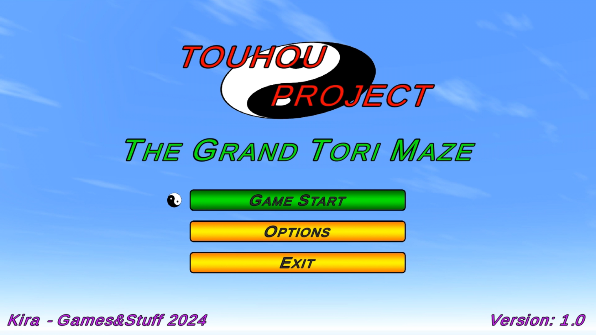
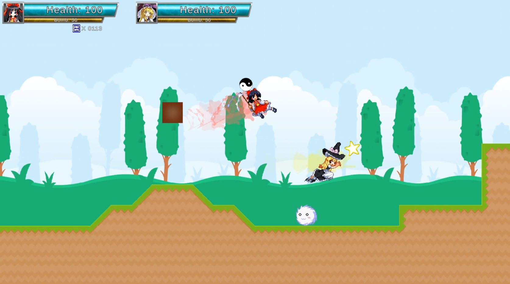
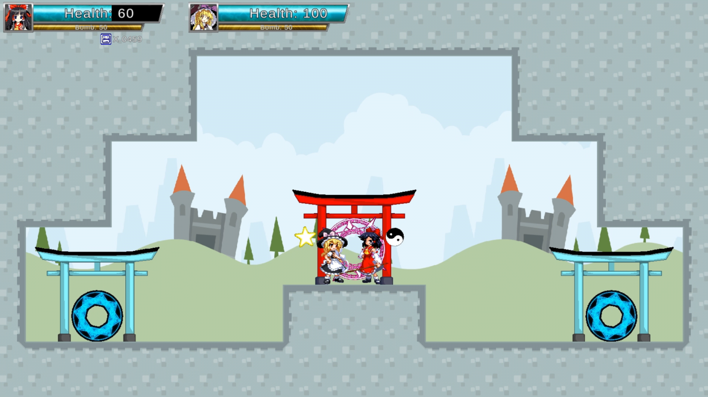

# Touhou Fangame - The Grand Tori Maze
Welcome everybody. This repository is to host a little Touhou fangame I made in 2024. This game is completely free and I don't own anything from Touhou Project mark, all rights are reserved to ZUN and Team Shangai Alice.
- It's a local coop 2D metroidvania game up to 2 players at the same time. 
- Someone is petrifying Gensokyo's people! It's Reimu's duty to stop this madness.
- The game is filled with teleports that will send you around worlds.
- You can only save at Hakurei's Shrine, make sure to pay a visit often, also if you get lost, you can always go back to the Shrine or check the Map via pause menu.
- If by change your character gets stuck, an unstuck button is implemented to fix it.
- If the player (or players in coop) dies, it respawns at Hakurei's Shrine.
- Default controls for keyboard are arrow keys to move, crouch and interact, Z to jump, X to shoot, C to attack, A to dash, S for skills, P to pause and U for unstuck (you can change every key but move and crouch).
- Second player needs a controller to play, being the left joystick used to move, crouch and interact, A to jump, X to shoot, Y for attack, B to dash, Right bumper for skills, Start to pause and Select for unstuck (on a Xbox controller).

Here's some screenshots of the game:

  

  

  

You can also watch a tutorial gameplay if you want [here](https://youtu.be/v9fUqCW6dRI)

  

